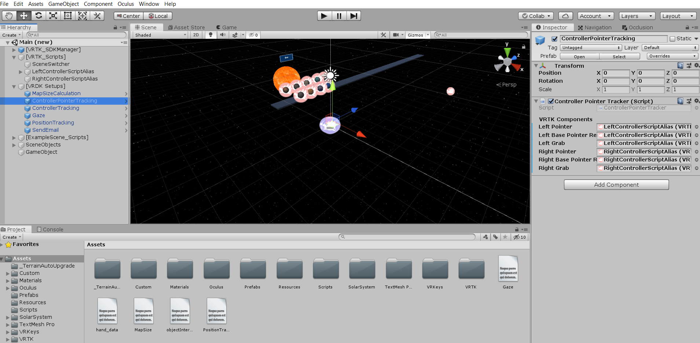
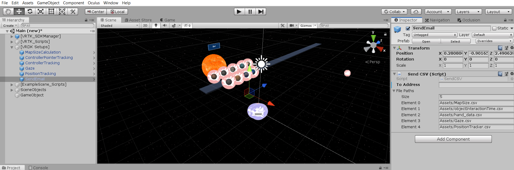

# HackIllinois2020 - VRDK (Virtual Reality Data Kit)
HackIllinois 2020 Open Source Hackathon - Developed by Jihoon Kang, TaeHyun Kim, Jae Lee, Jaewook Lee, Terry Luo, Raahul Natarrajan.

Welcome to VRDK! An extension to a widely popular open source project, VRTK! 

The VR systems, especially the Oculus lineup, have been used more frequently for research. To help with the data extraction process, we created VRDK! You can use this tool kit to extract gaze data, controller positions, player positions, and more!

## Setup
Download our project, which contains the Oculus Integration, VRTK, and VRDK!

It is as easy as adding a few prefabs! Create a parent object called [VRDK Setups] after setting up VRTK and the Oculus Integration. Under the [VRDK_Setups] object, attach the needed prefabs from Assets/custom/prefabs!

## Calculating the Map Size
Map size calculation is done by a prefab called MapSizeCalculation, which contains a script called Map Size Calculator. Where it says "Floor", drag and drop in the largest base floor that has a collider attached!

## Seeing where the user looks at - Gaze!
Gaze is a powerful tool used to measure focus and attention. Using the prefab called Gaze, you can generate a csv file containing the object the subject is looking at and for how long! Best part is that you do not have to edit this prefab! Simply drag and drop and see the magic happen!

## Tracking where your user is in the virtual environment
It is important to know where your subject is spending majority of the time at. A prefab called "PositionTracking" generates a csv file containing the location of the subject in the virtual environment! Using this, you can create cool visualizations like a heatmap! :))

## Tracking where your user's hands are
This can serve as a training dataset for the Oculus Quest headset to use to detect which motion the user is performing. The dataset will contain information about where the left and the right controllers are in the virtual environment!

## Tracking what the controllers do
This is the largest chunk of this toolkit. It measures what the pointers are pointing at, which object the user is grabbing, and which object the user is selecting using the pointers. The csv file looks daunting, but is full of useful information!

## Sending the data to..?
You may want to use VRDK to extract the data. Great! We even created a convinient way for you to email yourself the csv files! Simply type in your email in the "Send Email" file, and you will receive the csv files as soon as the application is done executing!

## Welcome to the VRDK Team!
We are so glad you decided to use this open source data collection toolkit! This is a sample of a file you will see from using this toolkit :)) Enjoy!

